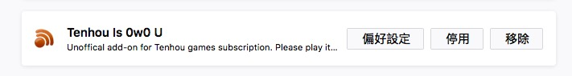
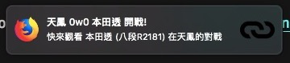
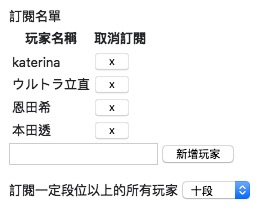

# Tenhou Is 0w0 U

Unoffical add-on for Tenhou games subscription. Please play it at https://tenhou.net/0/wg/

## Installation & Usage

FireFox Add-ons: https://addons.mozilla.org/zh-TW/firefox/addon/tenhou-is-0w0-u/

Setup:

1. Add your favorite players in the [addons setting page](about:addons) 

1. Add a tab, go to [https://tenhou.net/0/wg/](https://tenhou.net/0/wg/). Please keep the tab in your browser.

1. Enjoy!

## ScreenShots

#### Notification

#### Setting Page

## Features
- [x] Could be used in FireFox
- [x] Settings are synchronized by [FireFox Sync](https://support.mozilla.org/en-US/kb/how-do-i-set-sync-my-computer)
- [x] Notifications
- [x] Subscript players
- [x] Subscript dan (段位)

## TODO List

- [ ] Refactor
- [ ] Better Icons
- [ ] Subscription sharing
- [ ] Support for Chrome
- [ ] 日本語 & English
